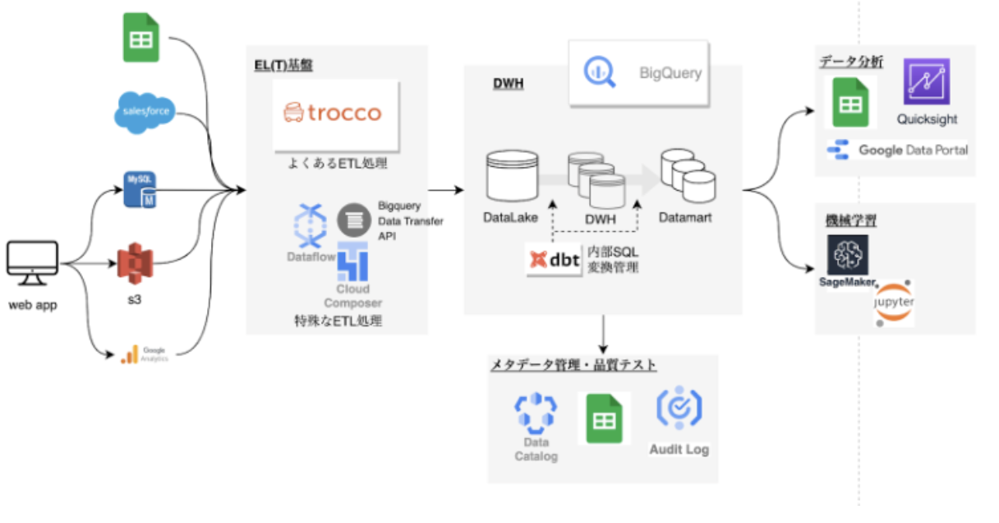

# 1. 概要

このリポジトリはデータ分析基盤構築におけるdbtのプロジェクトテンプレートです。

- [1. 概要](#1-概要)
  - [1.1. dbtとは](#11-dbtとは)
  - [1.2. dbtを使うメリット](#12-dbtを使うメリット)
  - [1.3. dbtは複雑?](#13-dbtは複雑)
  - [1.4. 用語について](#14-用語について)
- [2. ローカルの開発環境を整えよう](#2-ローカルの開発環境を整えよう)
  - [2.1. pipenvでの環境構築](#21-pipenvでの環境構築)
    - [2.1.1. 事前設定(pyenv,pipenvのインストール)](#211-事前設定pyenvpipenvのインストール)
    - [2.1.2. 各種python packageのインストール](#212-各種python-packageのインストール)
    - [2.1.3. profiles.ymlの設定](#213-profilesymlの設定)
    - [2.1.4. Bigqueｒyへのoauth認証を通す](#214-bigqueｒyへのoauth認証を通す)
    - [2.1.5. インストールが完了したかの確認](#215-インストールが完了したかの確認)
    - [2.1.6. vscode上で該当python環境をアクティブにする(拡張使うときのみ)](#216-vscode上で該当python環境をアクティブにする拡張使うときのみ)
  - [2.2. docker-composeでの環境構築](#22-docker-composeでの環境構築)
    - [2.2.1. 事前設定(dockerのインストール)](#221-事前設定dockerのインストール)
    - [2.2.2. profiles.ymlの設定](#222-profilesymlの設定)
    - [2.2.3. container立ち上げ \& vscodeのアタッチ](#223-container立ち上げ--vscodeのアタッチ)
    - [2.2.4. Bigqueryへのoauth認証を通す](#224-bigqueryへのoauth認証を通す)
  - [2.3. vscode拡張について](#23-vscode拡張について)
    - [2.3.1. dbt Power User](#231-dbt-power-user)
    - [2.3.2. Wizard of dbt Core](#232-wizard-of-dbt-core)
    - [2.3.3. sqlfluff](#233-sqlfluff)
- [3. リポジトリ構成](#3-リポジトリ構成)
  - [3.1. 全体のフォルダ構成](#31-全体のフォルダ構成)
  - [3.2. models内部のファイル](#32-models内部のファイル)
  - [3.3. models内部のフォルダ構成：stagingについて](#33-models内部のフォルダ構成stagingについて)
    - [3.3.1. ディレクトリ構成とファイル命名規則](#331-ディレクトリ構成とファイル命名規則)
    - [3.3.2. stagingでどういったSQLを書くのか](#332-stagingでどういったsqlを書くのか)
      - [3.3.2.1. 3.3.2.1 stagingでの日時のリネームとデータ変換](#3321-3321-stagingでの日時のリネームとデータ変換)
    - [3.3.3. sourceの設定について](#333-sourceの設定について)
    - [3.3.4. 行が変化するtransformが例外的に推奨される場合(興味ある人向け)](#334-行が変化するtransformが例外的に推奨される場合興味ある人向け)
    - [3.3.5. その他(興味ある人向け)](#335-その他興味ある人向け)
  - [3.4. models内部のフォルダ構成：intermediateについて(TODO)](#34-models内部のフォルダ構成intermediateについてtodo)
  - [3.5. models内部のフォルダ構成：martsについて](#35-models内部のフォルダ構成martsについて)
    - [3.5.1. ディレクトリ構成とファイル命名規則](#351-ディレクトリ構成とファイル命名規則)
    - [3.5.2. martsでどういったSQLを書くのか](#352-martsでどういったsqlを書くのか)
  - [3.6. modelsのmaterializedについて(興味ある人向け)](#36-modelsのmaterializedについて興味ある人向け)
  - [3.7. テストについて(興味ある人向け)(TODO)](#37-テストについて興味ある人向けtodo)
- [4. デプロイ(`dbt run`)について](#4-デプロイdbt-runについて)
  - [4.1. dbt runの概要](#41-dbt-runの概要)
  - [4.2. dbt runでBQのどこに保存されるか](#42-dbt-runでbqのどこに保存されるか)
  - [4.3. dbt run挙動の制御について(興味ある人向け)](#43-dbt-run挙動の制御について興味ある人向け)
    - [4.3.1. `custom_schema_name`の設定](#431-custom_schema_nameの設定)
    - [4.3.2. ターゲットの設定 (`target.name`/`target.database`/`target.schema`)](#432-ターゲットの設定-targetnametargetdatabasetargetschema)


## 1.1. dbtとは

ELTにおけるT(Transform)を担当するツールです。Biqquery内で「DataLake => DWH => Datamart」とデータを変換する際にSQLを記載しますが、その運用管理を行えるツールです。

<div style="text-align: center;">
    
    全体のアーキテクチャ
</div>

## 1.2. dbtを使うメリット

「Bigqueryにある標準SQLでもいいんじゃないの？」と思う人もいるでしょう。
DBTを導入した理由は、4つのメリットを享受でき、将来を見据えたSQLの運用管理が格段に楽になるからです。

1. テーブルの依存関係を自動で把握してくれる<br>
    SQL文の、`from <テーブル名>`の部分を`ref`構文に置き換えることで、テーブルの依存関係を自動的に把握してくれる。
    結果として、リネージ(テーブル生成の依存関係)が見えたり、テーブルのビルド順序すら自動的に判定してくれる！
2. テストやドキュメントが記載できる<br>
    ymlファイルにテストを記載することで、各テーブル(モデル)のテストが簡単に書ける。
3. SQLのverison管理が可能<br>
    SQLファイルで書くので、Githubでの管理が可能。
4. DRYなSQLを書くことができる<br>
    jinjaによるテンプレート構文が使えるので、変数・関数・繰り返しなどを表現できる。結果として非常に簡潔にSQL文をかける。

## 1.3. dbtは複雑?

様々なファイルがあって気遅れするかもしれないですが、設定ファイルなどが多いだけです。<br>
BQ上に新しいテーブルを作成したいときは、極論 **`models`ディレクト以下にsqlファイルを記載するだけ** です。<br>
「SQLファイル書くだけなのね」くらいの気持ちでキャッチアップしてください。

## 1.4. 用語について

dbtでは使われる用語は、BQで使われる意味と異なる場合があります。 \
その中でも特に混同しやすいものを列挙しましたので、しっかり抑えておいてください。

- データベース(database) : BQでいうプロジェクト
- スキーマ(schema) : BQでいうデータセット
- モデル(model) : BQでいうテーブル

# 2. ローカルの開発環境を整えよう

開発環境を構築します。 \
現状２つの方針があるので２つ記載します。(もしかしたら変わるかもなのでざっくり書く) <br>
また、開発効率が非常に上がるvscodeの拡張があるので、その使用方法も紹介します。(詳細は後述)

[dbtの実行環境作成] <br>
1. pipenvでの環境構築
   1. 事前設定(pyenv,pipenvのインストール)
   2. 各種python packageのインストール
   3. profiles.ymlの設定とファイル配置
   4. Bigqueryへのoauth認証を通す
   5. インストールが完了したかの確認
   6. vscode上で該当python環境をアクティブにする(拡張機能使うときのみ)
2. docker composeでの環境構築(他の環境でうまいこと行かずにpending)
   1. 事前設定(dockerのインストール)
   2. Bigqueryのサービスアカウントキーを配置
   3. profiles.ymlの設定
   4. container立ち上げ & vscodeのアタッチ

[vscode拡張機能のインストールについて] <br>
以下3つの拡張機能のインストールを推奨する
1. dbt Power User
2. Wizard of Dbt Core
3. sqlfluff

## 2.1. pipenvでの環境構築

ここではpipenvを用いた開発環境構築を行います。 \

### 2.1.1. 事前設定(pyenv,pipenvのインストール)

dbtをinstallするためにpythonの環境が必要となります。 \
python環境の管理をするために今回はpyenvとpipenvを使用します。

> 既に入れてる人はやる必要なし。

```sh

# pyenvのinstall
brew install pyenv

# zshrc使ってる人は
# bashやfish使ってる人は適宜変更してください。
echo 'export PYENV_ROOT="$HOME/.pyenv"' >> ~/.zshrc
echo 'command -v pyenv >/dev/null || export PATH="$PYENV_ROOT/bin:$PATH"' >> ~/.zshrc
echo 'eval "$(pyenv init -)"' >> ~/.zshrc

# pipenvのinstall
brew install pipenv

# pipenvでinstallした際に、今いるフォルダに.venvディレクトリ(仮想環境)を作成する設定
echo 'export PIPENV_VENV_IN_PROJECT=1' >> ~/.zshrc

# シェルを読み込み直す
source ~/.zshrc

```
以上で、pyenvとpipenvとライブラリのインストールは完了です。 <br>

> brewなどでもいれれるが、以下の理由からpythonでのインストールを行う。
> 1. dbtの明示的なversion管理をするため
> 2. 拡張機能でpython環境を明示する必要があるため

### 2.1.2. 各種python packageのインストール


各種python packageをインストールします。 \
ここからは`dbt-dmp`のリポジトリトップにいることを前提とします。


```sh
cd dbt-dmp # リポジトリの中に入る

# pythonライブラリのインストール
# cPython=3.9をinstallしますかと聞かれた場合は、yesを入力
pipenv sync

```

### 2.1.3. profiles.ymlの設定

`profiles.yml`は、各自のローカル開発時におけるdbt設定ファイルです。 \
以下のステップで設定します。

1. `profile.yml.sample`を`profiles.yml`と名前を変える
2. dataset名を(`<>`で囲まれた部分)を変更する
3. `~/.dbt/`配下に移動させる。(リポジトリ外にファイルを移動します)

```yml
default: # this needs to match the profile in your dbt_project.yml file
  target: dev
  outputs:
    dev:
      type: bigquery
      method: oauth # gcloud auth application-default loginを用いた認証を通す必要がある。詳しくはREADMEへ。
      project: <YourProject>
      dataset: <username> # 被らなさそうな名前に設定する。山崎陽平ならdbt_yyamasakiとか。localからdbt runしたときにデータが作成されるデータセット名に影響する。
      threads: 4
      timeout_seconds: 300
      location: asia-northeast1
      priority: interactive
```
### 2.1.4. Bigqueｒyへのoauth認証を通す

dbtからBigqueryを触れるように、oauthを用いて認証を通します。\
大きな流れは以下3ステップです。

1. `gcloud`というcliのインストール(既にinstallシてる人はスキップ可)
2. `gcloud auth application-default login`を実行
3. oauthのweb画面が開くので、googleアカウントでログイン

それでは具体的な操作を行っていきましょう。


1. : `brew install --cask google-cloud-sdk`を実行する(gcloud入ってない人のみ)
```sh

# brewでinstall
brew install --cask google-cloud-sdk

# 以下は必要な人のみ(筆者はなくて動いている)
echo 'source "/usr/local/Caskroom/google-cloud-sdk/latest/google-cloud-sdk/completion.zsh.inc"' >> ~/.zshrc
echo 'source "/usr/local/Caskroom/google-cloud-sdk/latest/google-cloud-sdk/path.zsh.inc"' >> ~/.zshrc

# shellを読み込み直す
source ~/.zshrc
```

2. 以下のコマンドを実行する。
```sh
# 自動でブラウザが開く or URLが表示されるのでそれをブラウザで開く
gcloud auth application-default login \
  --scopes=https://www.googleapis.com/auth/bigquery,\
https://www.googleapis.com/auth/drive.readonly,\
https://www.googleapis.com/auth/iam.test
```

3. BQへのアクセス権限を持つGoogleアカウントでログインする

以上で認証を通すステップは終了です。

> ⚠1 : 認証を一度通すと、`~/.config/gcloud/application_default_credentials.json`に認証情報が登録される。
> `dbt run`した際に、以下のエラーが出る場合は認証情報がない可能性が高い。
> ```sh
> Could not automatically determine credentials. Please set   GOOGLE_APPLICATION_CREDENTIALS or explicitly create credentials and re-run the application. For more information, please see https://cloud.google.com/docs/authentication/getting-started
> ```
> もう一度認証し直すことをおすすめする。 

> ⚠2 : `gcloud conifg configurations activate <project_name>`などでconfigを変えた場合もう一度実行し直す必要がある模様。 \
> ⚠3 : その他参考情報は[こちら](https://christina04.hatenablog.com/entry/gcp-auth)。


### 2.1.5. インストールが完了したかの確認

以下のステップで、`dbt`が適切に入っているかを確認して下さい。

```sh
pipenv shell  # 仮想環境の中に入る
dbt --version # dbt が入ってるかどうかの確認
dbt deps # 依存モジュールのインストール。buildやrunが動かない
dbt run --select tutorial_sample_companies # 試しに`models/sample/tutorial_sample_companies.sql`を実行してみる。
```


### 2.1.6. vscode上で該当python環境をアクティブにする(拡張使うときのみ)

vscode上では「どのpython環境を使用するか」を選択できます。 \
環境をinstallしても、せっかく


1. vscode上で`cmd + shift + p`でコマンドパレットを立ち上げる
2. `Python : Select Interpretur`を調べてEnter
3. `./venv`以下にあるpythonを選択する。

以上でローカル開発環境の立ち上げが完了です。


## 2.2. docker-composeでの環境構築

### 2.2.1. 事前設定(dockerのインストール)

以下のインストールお願いします。

- dockerのinstall
- vsCode拡張の`Dev Containers`のinstall \
  > docker環境にvscodeで入るために必要。


### 2.2.2. profiles.ymlの設定

1. `profiles.yml.sample`の名前を`profiles.yml`に変えてください
2. 以下のように編集してください

```yml
default: # this needs to match the profile in your dbt_project.yml file
  target: dev
  outputs:
    dev:
      type: bigquery
      method: oauth
      project: <YourProject>
      dataset: <your_username> # Replace this with dbt_your_name, e.g. dbt_yyamasaki
      threads: 4
      timeout_seconds: 300
      location: asia-northeast1
      priority: interactive
```

3. ファイルの配置 \
   `./.devcontainer/profiles.yml`に配置してください。

### 2.2.3. container立ち上げ & vscodeのアタッチ

AとBの方法がある。(どっちもやってることはかわらない)

1. vscodeサイドバーの「リモートエクスプローラー」と書かれたところをクリック
2. `open folder in container`を選択

> ⚠1 : 上記実行時は`.devcontainer/devcontainer.json`が必須となる。
> ⚠2 : 以下のやり方もある。こちらの場合`devcontainer.json`なくても動く
> 1. `cd .devcontainer`を実行
> 2. `docker compose up`でcontainerを立ち上げる
> 3. vscode左サイドバーのdocker拡張などから立ち上がったcontainerを右クリックで選択肢`Attarch Visual Codeを選択`

### 2.2.4. Bigqueryへのoauth認証を通す

1. 以下のコマンドを「dockerの環境内」で実行する。

```sh
gcloud auth application-default login \
  --scopes=https://www.googleapis.com/auth/bigquery,\
https://www.googleapis.com/auth/drive.readonly,\
https://www.googleapis.com/auth/iam.test
```

2. 「自動でブラウザが開く」or「URLが表示されるのでそれをブラウザで開く」
3. Googleにログインする
4. `authorization code`が出力されるので、それをターミナルに貼る


> ⚠1 : 認証を一度通すと、`.devcontainer/gcloud`以下にファイル群ができる。これは上記コマンドによりできる認証情報をlocalに保持するためにできるファイル群。
> (container側の`/root/.config/gcloud/`と同期している)
> 認証がおかしくなっていそうな場合は、`.devcontainer/gcloud`を消してもう一度認証し直すことをおすすめする。


## 2.3. vscode拡張について

3つの拡張機能をvscodeに入れる。 \
必須ではないが、非常に開発がしやすくなるので強く推奨する。

> ⚠1 : 拡張機能使用のためにいくつか必須なpythonライブラリがあるが、上記の環境構築時に既にインストールしているので気にしなくて良い。
> ⚠2 : 各拡張機能の設定に関しては、基本的に`.vscode/settings.json`で共有したものでいける(はず)。
> ⚠3 : dev container使ったinstallなら、remoteのvscodeに既に拡張機能入ってるはず。(`.devcontainer/devcontainer.json`で設定)

### 2.3.1. dbt Power User

実行関連のパワフルな補助をしてくれる拡張機能。主な機能は以下。
- `cmd + E`でローカルでクエリ結果を観察可能
- 対象ファイルのみのdbt runやdbt testを実行可能

> dbtのversionが1.4.0だとうごかない
> dbt Power Userのversionが0.11.0だと`dbt run`時の挙動がおかしくなる。
> errorを吐いてても動いたりするので、便利だがとっつきずらさはある。
  
### 2.3.2. Wizard of dbt Core

かなりリッチな入力補完が可能。主な機能は以下。
- refの定義元を参照可能
- ref関数で実在するモデル名を補間可能
- Bigqueryの関数のdescrpitionが見れる

### 2.3.3. sqlfluff

上記2つはformatter機能がないので、こちらを使用。主な機能は以下。
- `.sqlfluff`ファイルで設定を編集可能
- フォーマッタに違反してる文字の赤字提示
- `Cmd + P`からの`Sqlfluff Fix`でファイルの整形が可能

> dbt-formatterという拡張もあるが、bigquery用のSQLだと上手く動作しなかったため未使用。


# 3. リポジトリ構成

この章では、リポジトリ構成やファイルがどう配置されてるかを記載します。
基本的にdbtのベストプラクティスや基本設定に則ったリポジトリ構成です。
(気になる方は[こちら](https://docs.getdbt.com/guides/best-practices))

## 3.1. 全体のフォルダ構成

`dbt_dmp`の全体フォルダ構成は以下になっています。

```sh
dbt_project_template
├── analysis ## モデル化したくない分析・SQLを書きたい場合はこちらに記載する。
├── dbt_packages ## dbt depsしたら作成される、dbt packageの実態ファイルを管理するディレクトリ。初期はignoreしてるのでないはず。
├── seeds # csvファイルなどをモデル化したい場合は、ここに置く。dbt seedsでモデル化される。
├── models # 各種モデルを記載するディレクトリ。この中にSQLを書いていく作業がメインになる。
│   ├── intermediate # DHW層に該当するモデルを格納するディレクトリ。
│   ├── marts # データマート層に該当するモデルを格納するディレクトリ。
│   ├── staging # データレイク層に該当するモデルを格納するディレクトリ
│   └── utilities # 共通で使いたいモデルなどを格納するディレクトリ。
├── logs # logを管理するディレクトリ。勝手にたまっていくもの。
├── snapshots #  変更履歴を管理するSQLを記載した場合に格納するディレクトリ(基本使わない)。詳細は[公式:Snapshot](https://docs.getdbt.com/docs/building-a-dbt-project/snapshots)
├── target # dbtコマンドのログ、コンパイルファイルなどの出力先。gitignoreされている。
├── tests # スキーマテストを書きたいとき用のディレクトリ。
├── Pipfile # dbt自体や拡張機能に必要なライブラリをinstallするpipfile
├── Pipfile.lock # pipfileのlock
├── dbt_project.yml # project全体の設定ファイル。
├── packages.yml # dbt packagesを管理するディレクトリ。
├── profiles.yml.sample # profiles.ymlを作成するための雛形
└── README.md
```

色々ありますが、基本的には`models`以下の操作で多くの作業が完結します。そのため、次節からは`models`関連の話をメインに行います。

1. models内部のファイルの基本
2. models内部のフォルダ構成
   1. `staging`
   2. `intermediate`
   3. `marts`
3. dbt_project.ymlの設定(データエンジニア向け)

## 3.2. models内部のファイル

基本的には2つのファイルしか存在しません。
ymlファイルも必須でないので、極論sqlファイルを書いていくだけです。

1. sqlファイル<br>
 モデルのsqlを書くファイル。ファイル名がそのままBQのテーブル名になります。
2. ymlファイル<br>
モデルの説明やテストを記載をするファイル。あくまでoptionなのでなくても動きます。


> ⚠️1 : ymlファイルについて
> staging以下でのみ、既にBQに存在するテーブル(source)の読み込みという目的で使用されています。(後述)
> \
> ⚠️2 : sql・ymlファイルの読み込みについて
> 基本的に`models`以下の全てのsql,ymlファイルが読み込まれるので、実際はファイル名がどんな名前でどこに置かれていようと動作します。しかし、保守性が著しく欠けるので、次節以降のベストプラクティスに則ってファイルの作成・命名をすることを推奨します。

## 3.3. models内部のフォルダ構成：stagingについて

stagingのディレクトリ内部構成です。(TODO: 構成をjaffle_shopで)

基本的にやってることは3つです。

1. 簡単な整形(定義は後述)が必要なテーブルに対してのSQLを定義する
2. 上記SQLファイルに対してテストやdescriptionを記載するymlファイルを定義する(`~__models.yml`で定義)
3. BQに元々存在するテーブルを、soruceとして扱うための定義をする(`~__sources.yml`で定義)

よくあるモデル定義に加えて「`sources`の定義(後述)」が存在しています。
詳しくみていきましょう。

### 3.3.1. ディレクトリ構成とファイル命名規則

stagingでは以下の規則に従うことが推奨されます。

- ディレクトリについて
  - 構成：ソースシステムごとに分ける
  - 命名規則：`[ソース名]`でOK。
- ファイルについて
  - 構成：1ファイル1テーブル
  - 命名規則 : `stg_[ソース名]__[entity]s.sql`。

> ⚠️:ファイルの命名規則において`[ソース名]`をつけるのは、`ref`関数を使用する際にsourceが何か判定できるように。

### 3.3.2. stagingでどういったSQLを書くのか

「stagingって結局どういうsqlを書くの？」
「元々のデータのままじゃダメなの？」
と思った人も多いでしょう。

stagingでは、「複雑でないが共通して必要そうな変換」を行うことが推奨されます。
ざっくり言うと、「カラムの変更・増加」は○で、「行が増える」のはxです。
参考例として、以下の表を見てください。

| 推奨度合 | 変換処理  | 具体例  |
| ---   | ---           | --- |
|  ○    | リネーム      | `uriage`と言うカラム名を`sales`に変換する |
|  ○    | 型変換        | stringの売上データをintに変換する|
|  ○    | 基本的な計算   | 海外のドル売り上げを円に変換する |
|  ○    | カテゴライズ  | 年齢カラムから年代カラムを作成する |
|  x    | 結合(join)  | |
|  x    | 集計(aggregation)  |  |

#### 3.3.2.1. 3.3.2.1 stagingでの日時のリネームとデータ変換

troccoから日付や日時データをBigQueryに転送すると、デフォルトでtimestamp型で格納されます。
stagingでは以下のルールで日時をJST時刻に変換し使いやすくしてあげましょう。

データの変換
| ルール                  | 変換SQL                  | 元データの例                | 変換後の例               |
|----------------------|----------------------|-----------------------|---------------------|
| 日時を日本時間のdatetime型にする | datetime(created_at) | 2022-01-01 12:23:56+0 | 2022-01-01 21:23:56 |
| 日付をdate型にする          | date(CloseDate)      | 2022-01-01 23:00:00+0   | 2022-01-02          |

命名規則
| 種類       | 命名規則 | 例         | 
| --------- | ------- | ---------- | 
| 日時       | `_at`にする | CreatedDate => created_at | 
| 日時(JST)  | `_at_jst`にする | datetime(CreatedDate) => created_at_jst | 
| 日付       | `_date`にする | first_negotiation__c => first_nagotiation_date |

### 3.3.3. sourceの設定について

ymlファイル内の`sources`という項目にテーブルを指定することで、元のDWH上のテーブルをsourceとして扱えるようになります。メリットは２つです。

- lineageへの反映：`source('filename', 'table')`とすることでdbtでlineageに反映させられる
- testの実行：sourceデータに対してもテストを実行できる。

> ⚠️：ymlファイルを`..__models.yml`と`__sources.yml`で分ける必要はないが、わかりやすさのために分割することが推奨されています。

### 3.3.4. 行が変化するtransformが例外的に推奨される場合(興味ある人向け)

以下のような場合は、例外的に行数が変化するtransform(join, union)が推奨されます。(基本は作らなくて良さそう)

- joinの例：削除情報を別テーブルで管理してる場合
- unionの例：広告情報が別々だが、一元管理したテーブルを作成したい場合。

`base`というディレクトリを作成し、その下にmodelを記載するのが推奨されます。

参考ドキュメントは[こちら](https://docs.getdbt.com/guides/best-practices/how-we-structure/2-staging#staging-other-considerations)

> ⚠️：現状ここら辺の運用方針は決定してないので、詰めていきたい部分です

### 3.3.5. その他(興味ある人向け)

- 各種ymlやsqlファイルを作るコマンドラインパッケージがある。
  - 参考：[dbtでmodelやsourceのベースとなるコードを自動で生成してくれるpackage「codegen」を試してみた](https://dev.classmethod.jp/articles/dbt-package-codegen/)
- `models/utilities` directoryの使用
    - 出勤日などseedsから生成したデータなどは`models/utilities`に置いておくのもあり。

## 3.4. models内部のフォルダ構成：intermediateについて(TODO)

## 3.5. models内部のフォルダ構成：martsについて

### 3.5.1. ディレクトリ構成とファイル命名規則

stagingでは以下の規則に従うことが推奨されます。

- ディレクトリについて
  - 構成：関与するドメイン(部署などが多い)で分ける
  - 命名規則：無署名をつける(`marketing`, `finance`など)
- ファイルについて
  - 命名規則 : 基本的にシンプルな英語で`[entity名]_[verb].sql`というものが推奨される。各論になりやすいところなので、レビューや定期的なリファクタリングを行う。
    - 例1 : customers_aggregated_by_group.sql
    - 例2 : tax_payments.sql

> ⚠️:再度`source`をつけるのは`ref`関数を使用する際にsourceが判定できるように。

### 3.5.2. martsでどういったSQLを書くのか

martsはユーザやBIが直接参照したいデータを作成する部分です。
martsを作成する一例をみましょう。

```sql
-- orders.sql

with 

orders as  (

    select * from {{ ref('stg_jaffle_shop__orders' )}}

),

order_payments as (

    select * from {{ ref('int_payments_pivoted_to_orders') }}

),

orders_and_order_payments_joined as (

    select
        orders.order_id,
        orders.customer_id,
        orders.order_date,
        coalesce(order_payments.total_amount, 0) as amount,
        coalesce(order_payments.gift_card_amount, 0) as gift_card_amount

    from orders

    left join order_payments on orders.order_id = order_payments.order_id

)

select * from orders_and_payments_joined
```

marts作成時に気をつけるポイントは2つです。

1. 非正規化された横長なマートにする
   よくあるDBデータと違い、非正規化されたデータが推奨される。必要そうなデータが1つのテーブルで提供されるようなコンセプトがいいでしょう
2. あまりにも多くのjoinをmart内でしない
    多くの概念を一つのマートに持ち込むとややこしくなります。ここでいうあまりにも多くは抽象的な概念です。8つのstagingモデルをシンプルにジョインするだけなら問題ないです。逆に、4つの複雑なintermediateモデルにさらに複雑な処理をするなら推奨されません。中々ルール化が難しい(とdbt公式も言ってる部分)ですが、4~5つのコンセプトを持ち込もうとしてるなら、intermediateに切り分けた方がいいかもしれません。

## 3.6. modelsのmaterializedについて(興味ある人向け)

matrializedは、BQ上にどのようにデータを作成するかを決定するパラメータです。
materializedの種類は4つです。[(参考)](https://docs.getdbt.com/docs/build/materializations)

| 種類 | 特徴 |pros  | cons  |
| ---   | ---   | ---     | --- |
|  view    | データでなくqueryが保存される      | データ保存のお金がかからない。<br> 常に最新のビューが作成される | 対象モデルへのqueryに時間がかかる。<br> 参照するたびにクエリが走る。
|  table    | テーブルを作成し保存する        | クエリ時間が早い | 更新されないと最新のデータが反映されない
|  incremental    | 以前からの差分データをinsert/updateする     | クエリ | 追加設定(差分検知のカラムなど)が必要で、少々使いこなすのが難しい
|  ephemeral    |  BQ上に実体を作成しないモデル。CTE(共通テーブル式)のような扱い。 | BQを綺麗に保ちつつ、共通仕様のモデルを定義できる | モデルが生成されないので、バグ解決の際に追いづらい


基本的には、viewかtableを使い、状況に応じてincrementalやephemeralを用いるのがいいでしょう。[(詳しくはDBT Best Practice)](https://docs.getdbt.com/guides/best-practices/how-we-structure/1-guide-overview)

`models`以下の各ディレクトリにおいて、DBT公式が推奨するmaterializedもあります。

| ディレクトリ | 種類 | 理由  | 
| ---   | ---   | ---     |
|  staging    | view  | 下流のモデルが最新のデータを取得することが担保できる <br> データ使用者から直接叩かれないので、tableで保存する必要がない |
| intermediate   | table | viweかephemeralが推奨されているが、mart層でmetricsを複数使った際に`query is too complex`エラーが発生してしまうためtableに変更した |
|  mart    |  table  | BIから参照されるので、viewとかだと毎回クエリが走り遅くなる。<br> tableなら参照が早く済む。|

## 3.7. テストについて(興味ある人向け)(TODO)

後でかく


# 4. デプロイ(`dbt run`)について

本章では、モデルデプロイにおける挙動について説明します。

## 4.1. dbt runの概要

`dbt run`は、開発環境上で書いたSQLファイルをコンパイルし、BQ上に反映してくれるコマンドです。`dbt run`は主に2つの場所で実行されます。

1. dev環境(dbt cloudのエディタで実行) : 開発中のユーザが`dbt run`が正確に動くかを確認するために実行する
2. prod環境(dbt cloudのdeployment上で実行) : 本番環境に反映させるために実行する。

> ⚠️：prod環境は、基本的に`main` branchにマージしたコードを参照します。「本番に反映されない！」という時は、mainにマージしたかを確認してください。

各環境で`dbt run`をした場合に、BQのどこに保存されるか挙動の違いについて説明します。

## 4.2. dbt runでBQのどこに保存されるか

`dbt run`をした際に、BQ上のどのプロジェクトどのデータセットに生成されるかは、「環境」「ユーザ名」「カスタムスキーマ名」に依存します。

Environment | database(BQのプロジェクト) | schema(BQのデータセット)
---------|----------|---------
dev | <YourProject>-sandbox | [ユーザ名]__[カスタムスキーマ名]
prod | <YourProject> | [カスタムスキーマ名]

> ⚠️1：`ユーザ名`はdbt cloud上で自動に設定されるもの。(後述) <br>
> ⚠️2：`カスタムスキーマ名`は`dbt_project.yml`でディレクトリ毎に設定される。(後述)

例えば、`dbt_yyamasaki`というユーザ名のアカウントで`models/marts/marketing/customers.sql`というモデルをdbt runした場合は表のようになります。

Environment | database(BQのプロジェクト) | schema(BQのデータセット)
---------|----------|---------
dev | <YourProject>-sandbox | dbt_yyamasaki__<YourProject>_mart_marketing
prod | <YourProject> | <YourProject>_mart_marketing

注目すべきポイントは2つです。

- 1 : dev環境において、ユーザ毎にscheme(データセット)が作成される。<br>
  理由：複数人が開発している中で、他の人のデプロイが影響を及ぼさないようにしている。
- 2 : dev環境のモデルは、`<YourProject>-sandbox`という別database(プロジェクト)に全て生成される。<br>
  理由：devは「ユーザ数 x カスタムスキーマ数」の数だけschemeが生成されて汚くなりがち。prod環境を汚染しないようにprojectを切り分けている。

## 4.3. dbt run挙動の制御について(興味ある人向け)

`macro`ディレクトリ下の`get_custom_database.sql/get_custom_schema.sql`というファイルで挙動を制御できます。[(公式リンク)](https://docs.getdbt.com/docs/build/custom-schemas)


```jinja
<!-- get_custom_database.sql -->

    
        {{ target.database }}
    
        {{target.database}}-sandbox
    

```

``` jinja
<!-- get_custom_schema.sql -->

    
        
            {{ target.schema }}
        
            {{ custom_schema_name | trim }}
        
    
        
            {{ target.schema }}
        
            {{ target.schema }}_{{ custom_schema_name | trim }}
        
    

```

### 4.3.1. `custom_schema_name`の設定

方法は2つです。[(公式リンク)](https://docs.getdbt.com/docs/build/custom-schemas)<br>

① `dbt_project.yml`の`models`以下で、指定したいディレクトリの`scheme`を設定する

```yml
# dbt_project.yml
# models in `models/marketing/ will be rendered to the "*_marketing" schema
models:
  dbt_project_template:
    marketing:
      +schema: marketing
```

② `models`ファイルの中でconfig関数を使用する

```sql
-- some sql file which should be in mareketing schema.
{{ config(schema='marketing') }}
select ...
```

②は個別ファイルを参照する必要があるので、基本的には①で設定するのが望ましいです。

### 4.3.2. ターゲットの設定 (`target.name`/`target.database`/`target.schema`)

ターゲットの値は、
- dbt coreの場合：`profiles.yml`に設定された値
- dbt cloudの場合：以下が反映される。

Environment | target.name | target.schema | target.database
|------|----------|---------|---------|
dev | Job毎に設定 | Environmentで設定 | DBT projectの「AccountSettings > Credentials > Connection」で設定される
prod | DBT projectの「AccountSettings > Credentials > Development Credentials」で設定 | 左と同様 | 上と同様
